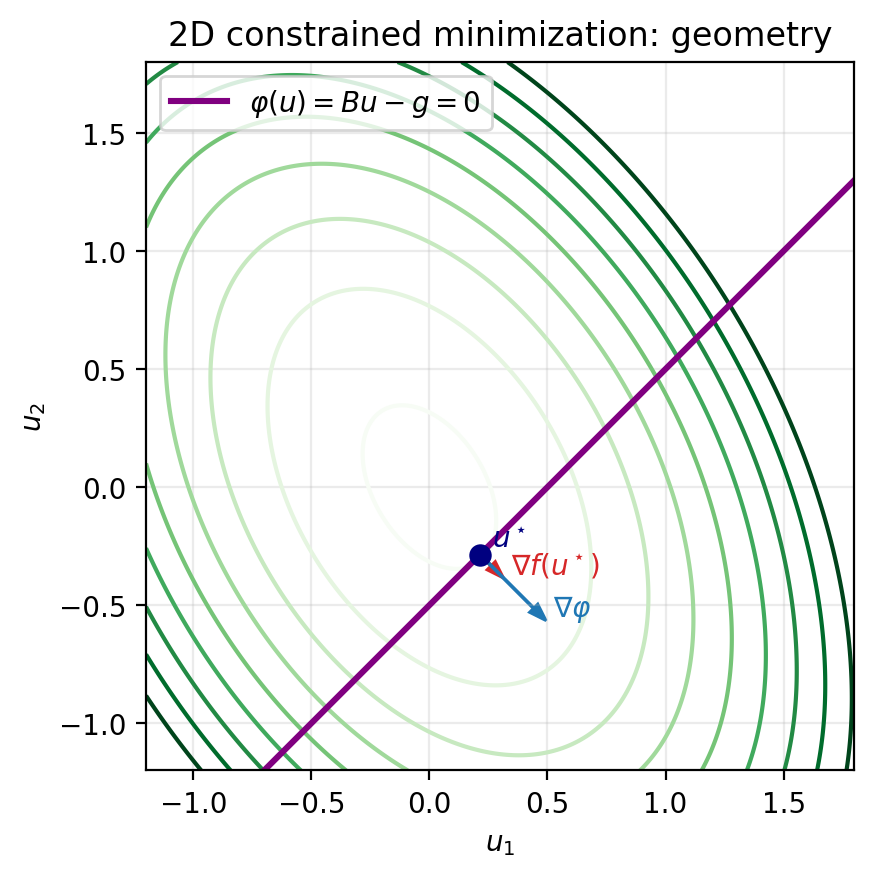

# Introduction & Motivation

Numerical Methods for Optimal Control (NMOPT)

Luca Heltai (<luca.heltai@unipi.it>)

----

## What Is Optimal Control?

- Choose a control $u$ to minimize a cost $J(y,u)$.
- The state $y$ is constrained by a model (often a PDE).
- Optimization + differential constraints = PDE-constrained optimization.

----

## Abstract Formulation

Minimize
$$
\min_{y,u} \; J(y,u)
$$
subject to the state equation
$$
\mathcal{E}(y,u) = 0.
$$

Typical pieces:

- state equation (PDE)
- admissible controls $u \in \mathcal{U}_{\mathrm{ad}}$
- constraints (box constraints, etc.)

----

## Forward vs Optimal Control

- Forward (direct) problem:
  - input data given
  - solve PDE once to compute $y$
- Optimal control:
  - control $u$ unknown
  - PDE is solved repeatedly while optimizing $J$

Key point: the PDE is a *constraint*, not the objective.

----

## Reduced Formulation

If the state equation defines a control-to-state map $S$:
$$
y = S(u),
$$
then define the reduced cost
$$
f(u) := J(S(u),u),
$$
and solve
$$
\min_{u} f(u).
$$

Why it matters:

- separates "PDE solve" from "optimization step"
- makes gradients/adjoins systematic

---

## Tiny Example Notebook

- Finite-dimensional LQ reduction + a 1D slice plot.
- Generates figures used in these slides.

File: `codes/lecture01/finite_dim_analogy.ipynb`

----

## Example: Reduced Cost Shape

----

## Control-to-State Pipeline

----

## A Finite-Dimensional Analogy

Given $A y = B u$ with invertible $A$:
$$
y = A^{-1} B u =: S u
$$
Reduced problem:
$$
\min_u f(u) := J(Su,u).
$$

This is the template we will reuse in infinite dimensions.

----

## Constrained Minimization in 2D

Consider
$$
\min_{u\in\mathbb{R}^2} f(u)=\frac12 u^T A u
\quad \text{s.t.} \quad
\varphi(u)=Bu-g=0,
$$
with $A$ SPD, $B\in\mathbb{R}^{1\times 2}$.

At an optimum:
$$
\nabla f(\bar u)-(\nabla\varphi(\bar u))^T\lambda=0,
\qquad
\varphi(\bar u)=0.
$$

----

## Lagrangian and KKT System

Lagrangian:
$$
\mathcal{L}(u,\lambda)=f(u)-\varphi(u)\cdot \lambda
$$

Stationarity:
$$
\nabla_u\mathcal{L}=Au-B^T\lambda=0,\qquad
\nabla_\lambda\mathcal{L}=-Bu+g=0.
$$

Equivalent saddle-point linear system

$$\begin{pmatrix}A & -B^T \\\ -B & 0\end{pmatrix}\begin{pmatrix}u \\\ \lambda\end{pmatrix}=\begin{pmatrix}0 \\\ -g\end{pmatrix}$$

----

## 2D Constrained Geometry

----

## Objective on the Feasible Line

----

## When PDEs Show Up

States: temperature, displacement, velocity, concentration, ...

Controls:

- distributed sources
- boundary inputs
- initial conditions
- parameters / coefficients

----

## Typical Examples

- Elliptic: stationary heating / diffusion
- Parabolic: time-dependent heating
- Nonlinear: Navier-Stokes flow control
- Inverse problems: parameter estimation / data assimilation

----

## Constraints

Common: box constraints on the control
$$
u_{\min} \le u \le u_{\max}.
$$

Leads to:

- variational inequalities
- KKT conditions
- active-set / projection-type algorithms
