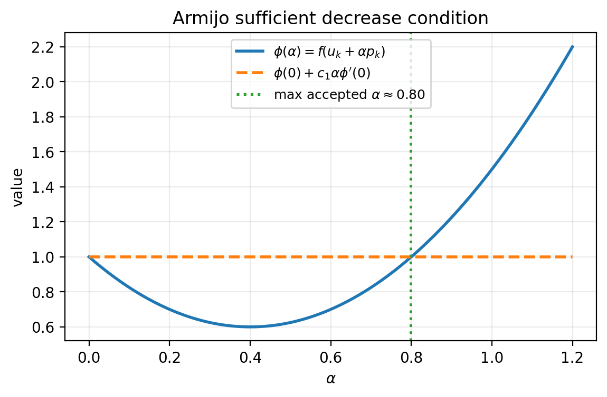
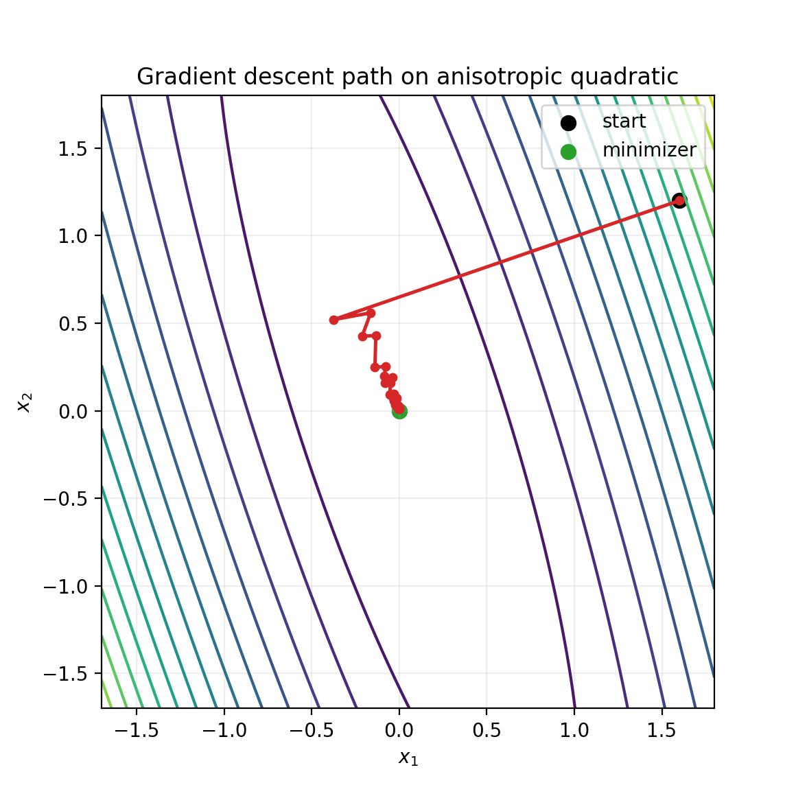
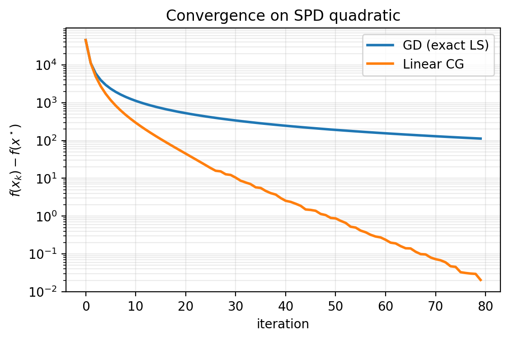
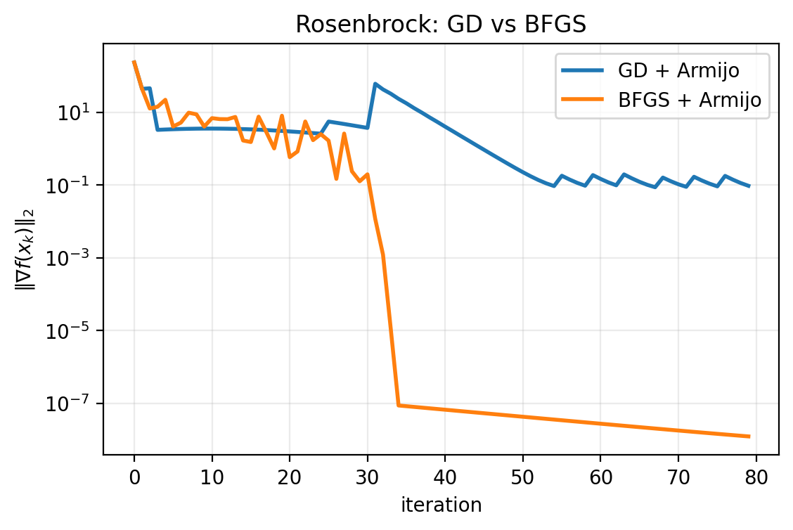
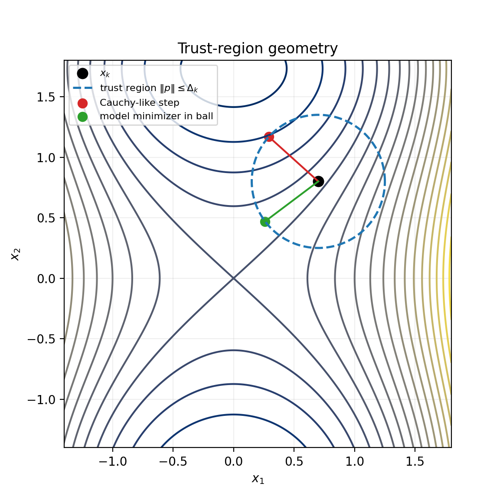

# Unconstrained Numerical Optimization Toolbox

Numerical Methods for Optimal Control (NMOPT)

Luca Heltai (<luca.heltai@unipi.it>)

----

## Context

We will soon solve reduced OCPs of the form
$$
\min_u f(u)=J(S(u),u).
$$

Before PDE details, we need a robust optimization toolbox:

- choose directions
- globalize iterations
- compare cost vs robustness

----

## One Template, Many Methods

All methods fit
$$
u_{k+1}=u_k+\alpha_k p_k.
$$

Design blocks:

- direction $p_k$
- step rule $\alpha_k$
- globalisation (line-search or trust-region)
- stopping criteria

----

## Line Search and Armijo

Given descent direction $g_k^T p_k<0$, Armijo accepts $\alpha$ if
$$
f(u_k+\alpha p_k)\le f(u_k)+c_1\alpha g_k^T p_k.
$$

Backtracking:

- start from $\alpha_0$
- shrink $\alpha\leftarrow \beta\alpha$ until accepted

Cheap and robust default.

----

## Armijo Geometry

----

## Gradient Descent (GD)

$$
p_k=-g_k,\qquad g_k=\nabla f(u_k).
$$

Pros:

- minimal per-iteration cost
- baseline method for any new model

Cons:

- sensitive to conditioning
- slow on narrow valleys

----

## GD on Anisotropic Quadratic

----

## Nonlinear Conjugate Gradient

$$
p_k=-g_k+\beta_k p_{k-1}.
$$

Common choices:

- Fletcher-Reeves
- Polak-Ribiere+

Key idea: re-use previous direction information without storing a Hessian.

----

## Nonlinear CG vs GD

----

## BFGS Quasi-Newton

Direction:
$$
p_k=-H_k g_k,\qquad H_k\approx \nabla^2 f(u_k)^{-1}.
$$

BFGS update uses
$$
s_k=u_{k+1}-u_k,\quad y_k=g_{k+1}-g_k,\quad y_k^Ts_k>0.
$$

Usually a strong default for smooth medium-size problems.

----

## BFGS on Rosenbrock

----

## Trust Region

At iteration $k$, solve
$$
\min_{\|p\|\le\Delta_k}
m_k(p)=f_k+g_k^Tp+\frac12 p^TB_kp.
$$

Accept with ratio
$$
\rho_k=\frac{f(u_k)-f(u_k+p_k)}{m_k(0)-m_k(p_k)}.
$$

Good robustness for nonconvex/indefinite settings.

----

## Trust-Region Geometry

----

## Practical Choice Guide

- `GD + Armijo`: safest baseline
- `NLCG`: low memory, often faster than GD
- `BFGS`: excellent default for smooth problems
- `Trust-region`: strongest robustness when curvature is hard

In reduced PDE OCPs, optimize for fewer expensive gradient evaluations.

----

## Lecture Notebook

`codes/lecture03/optimization_toolbox.ipynb`

Contains finite-dimensional conceptual experiments for:

- GD + Armijo
- nonlinear CG
- BFGS
- trust-region (dogleg)

----

## Transition to PDE-Constrained OCP

Next step:

1. derive reduced gradient with state/adjoint equations
2. plug it into today’s algorithms
3. compare optimize-then-discretize and discretize-then-optimize
